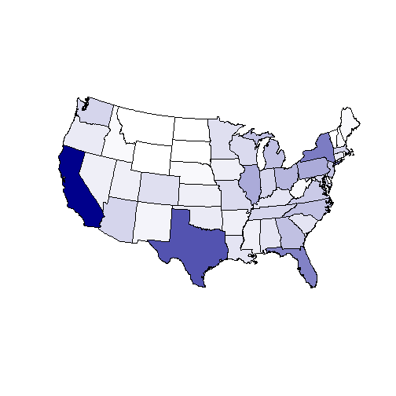

United States Population Study
========================================================
author: Fred Smith
date: Tue Jun 07 17:38:50 2016

This presentation describes my submission for the final project of the "Developing Data Products" course of the Data Science Specialization offered by Coursera.

Project Objectives
========================================================

Learn presentation and publication tools for data science.

- Shiny interactive web applications
- R Studio Presentor or Slidify for R-enabled presentations
- Github to manage and distribute source and compiled files
- Project analysis and subject were left to the student, but required non-trivial and dynamic content

Population Study
========================================================

I chose to analyze census data and visually answer such questions as:

- Which states have the largest and smallest populations?
- Over the last 5 years, which state populations have had the largest increases and decreases?

Otherwise, my goal was to keep the application as simple as possible.

- No numbers, only graphics (colored maps)
- No legends, as they are not required to answer the questions

Census Data
========================================================

United States Census Bureau

- Start here - http://www.census.gov/popest/data/national/totals/2015/
- NST-EST2015-alldata dataset was used
- PDF describes the schema
- CSV contains the data
- Only the annual population columns were used for this study

Shiny Application
========================================================

Uses maps package to draw [dynamic choropleth maps](https://fsmith.shinyapps.io/master/).

- Drawn in R
- Colored by population
- Darker colors for higher populations
- Relative populations are visually obvious

[Project Index](http://fsmithus.github.io/DevelopDataProducts-Project/index.html)

***

